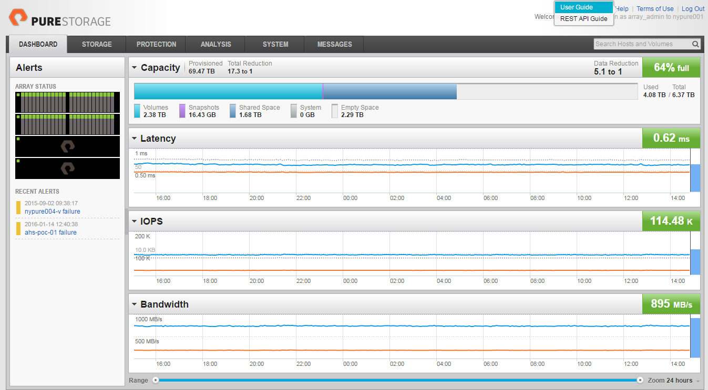

*********************************************************************
Guide to the Pure Storage Cinder Plugin version 2.0-2.0..0-1 for Fuel
*********************************************************************

This document provides instructions for installing, configuring and using
Pure Storage Cinder plugin for Fuel.

Pure Storage Cinder
===================

The Pure Storage Cinder Fuel plugin provides an automated method
to insert the necessary lines into the ``cinder.conf`` file. The plugin
extends the Fuel Web UI to provide the necessary entry locations for the
information for the configuration file. Thus, the plugin incorporates
`OpenStack Cinder Driver for Pure Storage Flash Array <http://stackalytics.com/report/driverlog?project_id=openstack%2Fcinder&vendor=Pure%20iSCSI%2FFC%20Storage>`_.
Thus, the plugin provides the ability to
create a configuration file stanza so that when multi-backend support
is selected, the stanza is correct.

License
-------

=======================   ==================
Component                  License type
=======================   ==================
No Components are present

============================================

Requirements
------------

=======================   ==================
Requirement                 Version/Comment
=======================   ==================
Fuel                      8.0

============================================

Pre-requisites
--------------

The Pure Storage array should be configured and connected to your network prior
to configuring your OpenStack deployment.

For more information on the Array configuration, follow
the official documentation available from witrhin the 
array GUI as shown below (top right of screen under Help section)

Limitations
-----------

No limitations are present

Installation Guide
==================

Pure Storage Cinder Plugin installation
---------------------------------------

1. Download the plugin from the `Fuel Plugins Catalog <https://www.mirantis.com/products/openstack-drivers-and-plugins/fuel-plugins/>`_.

2. Copy the plugin to an already installed Fuel Master node. If you do not
   have the Fuel Master node yet, please follow `the instructions <https://docs.mirantis.com/openstack/fuel/fuel-8.0/quickstart-guide.html#quickstart-guide>`_:

   ::

     scp  fuel-plugin-purestorage-cinder-2.0-2.0.0-1.noarch.rpm root@:<the_Fuel_Master_node_IP>:/tmp

3. Log into the Fuel Master node.

4. Install the plugin

   ::

     cd /tmp
     fuel plugins --install fuel-plugin-purestorage-cinder-2.0-2.0.0-1.noarch.rpm

5. Check if the plugin was installed successfully

  ::

     # fuel plugins
     id | name                           | version | package_version
     ---|--------------------------------|---------|----------------
      1 | fuel-plugin-purestorage-cinder | 2.0.0   | 4.0.0

6. After the plugin is installed, `create a new OpenStack environment <https://docs.mirantis.com/openstack/fuel/fuel-8.0/user-guide.html#create-a-new-openstack-environment>`_ using the Fuel UI Wizard.

7. `Configure your environment <https://docs.mirantis.com/openstack/fuel/fuel-8.0/user-guide.html#configure-your-environment>`_.

8. Open the Settings tab of the Fuel Web UI and scroll down the page. Select the Storage section to enable Pure Storage driver in Cinder plugin checkbox.

  .. image:: figures/cinder-purestorage-liberty-plugin-1.png
         :width: 100%
  .. image:: figures/cinder-purestorage-liberty-plugin-2.png
         :width: 100%

9. Enter the Purity API Token and the IP address of the management VIP of the Pure Storage FlashArray.

* Obtain the Purity API token from the Pure Storage GUI

  ::

     System->Users->API Tokens: Select User, click gear icon by use select 'Show API Token'

  .. image:: figures/api-Collection.png
         :width: 100%

or use the following Purity CLI command to obtain the API token:

  ::

     # pureadmin list --api-token --expose <USER>

* Obtain the Pure Storage VIP from the Pure Storage GUI

  ::

     System->System->Configuration->Networking: Use the IP addresses associated with 'vir0'

  .. image:: figures/VIP-Collection.png
         :width: 100%

or use the following Purity CLI command to obtain the VIP address:

  ::

     # purenetwork list vir0

10. Select the defaults for all other Pure Storage options. Each selectable option has a description in the Fuel GUI.

11. If using Fibre Channel as the storage protocol you need to select the zoning method to be used in your deployment. If you are configuring your own zones then select 'Manual' but you can select 'Automatic' if you wish to use the Openstack Fibre Channel Zone Manager. If 'Automatic' is selected you will need to provide the necessary information for the Zone Manager to communicate and configure your fibre channel switches.

  .. image:: figures/fc-options.png
         :width: 100%

User Guide
==========

Once the OpenStack instance is deployed by Fuel the Pure Storage plugin provides no
user configurable or maintainable options.

Validation of the plugins correct operation can be performed by comparing the parameters selected in the Fuel GUI to those added into the 
/etc/cinder/cinder.conf and /etc/nova/nova.conf files on the Controller and Compute nodes respectively.

As part of this installation a new multipath.conf file is provided to all nodes. Ensure that other device entries required for your
local environment are added to these files and multipath is restarted to accept any changes.

The Pure Storage driver (once configured by Fuel) will output all logs into the
cinder-volume process log file with the 'Pure Storage' title.

Known issues
============

1. Ensure your controller nodes have access to the public internet to allow for correct Python module installation required by the Fuel plugin

2. If you environment is deployed with multiple controllers for HA, you cannot run all the Cinder Volume services at the same time in Active-Active mode

3. There are specific changes that need to be made to the local deb packages. More details can be found in the Pure Storage/Mirantis Reference Architecture

Appendix
========

1. `OpenStack Cinder Driver for Pure Storage Flash Array <http://stackalytics.com/report/driverlog?project_id=openstack%2Fcinder&vendor=Pure%20iSCSI%2FFC%20Storage>`_

2. `Pure Storage Flash Array Volume Driver <http://docs.openstack.org/kilo/config-reference/content/pure-storage-driver.html>`_
